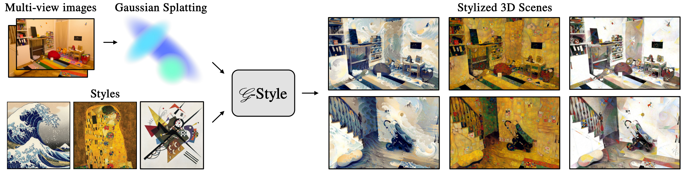

# G-Style: Stylized Gaussian Splatting
[Áron Samuel Kovács](https://www.cg.tuwien.ac.at/staff/AronKovacs), [Pedro Hermosilla](https://phermosilla.github.io/), [Renata G. Raidou](https://www.cg.tuwien.ac.at/staff/RenataRaidou)




This repository contains the official implementation of the paper "G-Style: Stylized Gaussian Splatting."

Abstract: *We introduce G-Style, a novel algorithm designed to transfer the style of an image onto a 3D scene represented using Gaussian Splatting. Gaussian Splatting is a powerful 3D representation for novel view synthesis, as—compared to other approaches based on Neural Radiance Fields—it provides fast scene renderings and user control over the scene. Recent pre-prints have demonstrated that the style of Gaussian Splatting scenes can be modified using an image exemplar. However, since the scene geometry remains fixed during the stylization process, current solutions fall short of producing satisfactory results. Our algorithm aims to address these limitations by following a three-step process: In a pre-processing step, we remove undesirable Gaussians with large projection areas or highly elongated shapes. Subsequently, we combine several losses carefully designed to preserve different scales of the style in the image, while maintaining as much as possible the integrity of the original scene content. During the stylization process and following the original design of Gaussian Splatting, we split Gaussians where additional detail is necessary within our scene by tracking the gradient of the stylized color. Our experiments demonstrate that G-Style generates high-quality stylizations within just a few minutes, outperforming existing methods both qualitatively and quantitatively.*

## Running the code

You need to have Python 3. This implementation also requires CUDA.

Python 3 dependencies:

* numpy>=1.21.6
* torch>=1.12.1

Run the `train.py` script with the following parameters:
```
python train.py -s <path to data folder with gt images> -m <path to output folder with a pretrained scene> --resolution <desired training resolution> --starting_iter 30000 --path_style <path to a style image>
```

Optionally you can add `--forward_facing` for forward-facing scenes.

This script assumes that the `-m` folder contains a pretrained scene, by default stored within a `iteration_30000` subfolder. The result will be saved in the same folder. To view it, you can use the `SIBR_viewer` as in the original work by Kerbl et al.

## BibTeX
Paper:
```
tbd
```

Code:
```
@inproceedings{kovacs2024gstyle_code,
  title={G-Style: Stylized Gaussian Splatting: Code Implementation},
  author={Kov{\'a}cs, {\'A}ron Samuel and Hermosilla, Pedro and Raidou, Renata G},
  year={2024},
  url={\url{https://github.com/AronKovacs/g-style/}}
}
```
